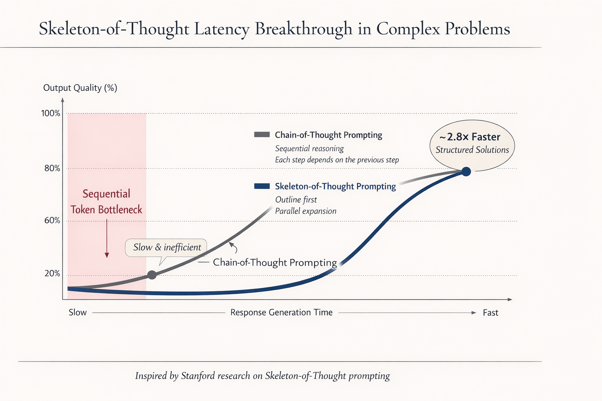

# Skeleton-of-Thought Prompting

**I keep coming back to the same observation. The bottleneck in LLM applications is rarely the model. It is how we prompt it. Chain-of-Thought made models smarter. Skeleton-of-Thought makes them faster. The difference matters more than most people realise.**

## The Problem I Keep Seeing

I spend a lot of time building with LLMs. One pattern comes up over and over.

You ask a model a complex question. You use Chain-of-Thought prompting because it genuinely improves output quality. The model reasons step by step. Step 1 leads to step 2, step 2 leads to step 3. Good. But slow.

Every step waits for the previous one. The token generation is sequential. For a 10-step answer, you pay the full latency of all 10 steps stacked end to end. There is no way around it within the CoT paradigm. Step 7 literally cannot begin until step 6 finishes.

I have watched this bottleneck kill user experience in real applications. A 15-second response time is fine for a research query. It is not fine for an AI Agent executing a workflow or a real-time assistant answering a customer.

## How SoT Breaks the Bottleneck

Skeleton-of-Thought prompting does something obvious in hindsight. It separates structure from detail.

**First call — the skeleton.** You ask the model for just the outline. A numbered list of key points. No explanation. No elaboration. Just the bones of the answer. This is fast because the output is short.

**Parallel calls — the expansion.** You take each point from the skeleton and expand it in a separate API call. Point 1 does not need to know about point 3. They are independent. So you fire all expansion calls simultaneously.

```
CoT:  [step 1]──▶[step 2]──▶[step 3]──▶[step 4]──▶[step 5]
      Total = sum of all steps

SoT:  [skeleton]──▶┬──[expand 1]──▶┐
                   ├──[expand 2]──▶│
                   ├──[expand 3]──▶├──▶ [assemble]
                   ├──[expand 4]──▶│
                   └──[expand 5]──▶┘
      Total = skeleton + max(expansions)
```

The total wall-clock time is the skeleton call plus the slowest expansion. Not the sum of all expansions. For a 5-point answer, you are paying for 2 sequential calls instead of 5.

The research by Ning et al. reported speed-ups of up to 2x+ with comparable output quality. In my own testing, the speedup depends heavily on the question structure. Decomposable questions benefit the most.

## Where I Have Seen It Work

I have been experimenting with SoT across different use cases. The pattern is clear.

It works well when the answer has a natural structure — multiple independent points that do not depend on each other. "Explain the differences between X and Y." "What are the key principles of Z?" "List the pros and cons of A." Any question where the answer decomposes into parallel branches.

It does not work when reasoning is genuinely sequential. Mathematical proofs. Debugging chains where each step follows from the last. Creative writing where narrative flow matters. If step 3 truly depends on step 2, you cannot parallelise it. That is not a limitation of SoT. It is the nature of the problem.

The interesting insight is that far more answers are decomposable than most of us assume. We default to sequential prompting out of habit, not necessity.

## The Code

I built three examples to demonstrate the pattern. All using the Anthropic SDK with `asyncio.gather()` for parallel expansion.

### The 40-Line Version

This is the entire SoT technique in minimal code.

```python
from anthropic import Anthropic
import asyncio

client = Anthropic()

def skeleton(question):
    r = client.messages.create(
        model="claude-haiku-4-5-20251001", max_tokens=256,
        messages=[{"role": "user", "content":
            f"List 4-6 key points to answer: {question}\n"
            f"Numbered list only. No detail."}],
    )
    return [line.lstrip("0123456789.-) ").strip()
            for line in r.content[0].text.strip().split("\n")
            if line.strip() and line.strip()[0].isdigit()]

async def expand(question, point):
    loop = asyncio.get_event_loop()
    def _call():
        r = client.messages.create(
            model="claude-haiku-4-5-20251001", max_tokens=300,
            messages=[{"role": "user", "content":
                f"Context: answering '{question}'\n"
                f"Expand into 2-3 sentences: {point}"}],
        )
        return r.content[0].text.strip()
    return await loop.run_in_executor(None, _call)

async def sot(question):
    points = skeleton(question)
    expansions = await asyncio.gather(*[expand(question, p) for p in points])
    return "\n\n".join(f"**{p}**\n{e}" for p, e in zip(points, expansions))

print(asyncio.run(sot("Explain how DNS works")))
```

Two sequential calls (skeleton then assemble), but the expansion phase fires N calls in parallel. For a 5-point answer, you get 5 parallel calls instead of one long sequential generation.

### Head-to-Head Comparison

```bash
python examples/sot_vs_cot.py "What are the key differences between microservices and monolithic architecture?"
```

Same question through both CoT and SoT. Measures latency. Prints the speedup ratio. Run it yourself and see the difference.

### Batch Evaluation

```bash
python examples/sot_batch.py
```

Runs 5 questions through both approaches and prints a comparison table. This is where the pattern becomes obvious across different question types.

## Running It

```bash
pip install anthropic
export ANTHROPIC_API_KEY=sk-ant-...

# Minimal example
python examples/sot_basic.py "Explain how DNS works"

# Head-to-head with timing
python examples/sot_vs_cot.py

# Batch comparison table
python examples/sot_batch.py
```

## The Tradeoff

SoT is not free. You make more API calls. Total token usage may be higher. The individual expansions lack cross-point context — point 3 does not know what point 2 said.

For latency-sensitive applications — AI Agents executing workflows, real-time assistants, interactive tools — the tradeoff is worth it. Wall-clock time drops. The user gets a structured answer faster.

For applications where coherence across points matters more than speed, CoT remains the right choice. The two approaches are not competitors. They are tools for different situations.

## What I Take Away From This

I think about prompting strategies as architecture decisions, not syntax choices. CoT treats reasoning as a serial process. SoT treats it as a parallelisable one. The choice between them is the same choice engineers make in every distributed system — serial consistency or parallel throughput.

The insight from SoT is that many problems we treat as sequential are actually decomposable. We prompt sequentially because that is how we think, not because the problem demands it.

Outline first. Expand in parallel. Assemble.

It is how humans approach complex problems. Turns out it works for LLMs too.

---

**Reference:** Ning, X., et al. (2023). Skeleton-of-Thought: Prompting LLMs for Efficient Parallel Generation. arXiv:2307.15337.

---

*Chief Evangelist @ Kore.ai | I'm passionate about exploring the intersection of AI and language. Language Models, AI Agents, Agentic Apps, Dev Frameworks & Data-Driven Tools shaping tomorrow.*
